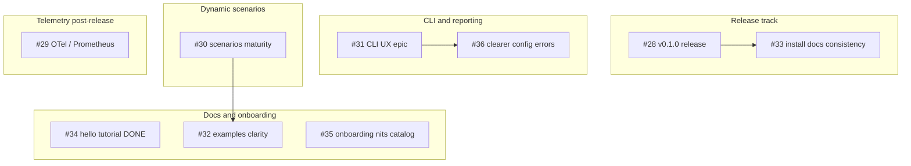

# Open Issue Triage Report

**Date:** 2026-08-12  
**Repo:** [OrekGames/pummel](https://github.com/OrekGames/pummel)  
**Scope:** All open issues `#28`–`#36` (9 issues)  
**Method:** Validity / relevance / accuracy / actionability scoring plus adversarial verification against `main` (code, docs, CLI repros, tags/releases).

This report does **not** change GitHub labels or close issues (CLI write access is unavailable in this environment). Recommended maintainer actions are listed at the end.

## Summary verdicts

| Issue | Title | Verdict | Recommended priority | Recommended status |
| ----- | ----- | ------- | -------------------- | ------------------ |
| [#28](https://github.com/OrekGames/pummel/issues/28) | Epic: v0.1.0 release readiness | **keep** | `priority:high` (unchanged) | `status:ready` |
| [#29](https://github.com/OrekGames/pummel/issues/29) | Epic: Telemetry exporters | **reprioritize** | `priority:low` (was normal) | `status:ready` |
| [#30](https://github.com/OrekGames/pummel/issues/30) | Epic: Dynamic scenarios maturity | **narrow** | `priority:normal` | `status:ready` |
| [#31](https://github.com/OrekGames/pummel/issues/31) | Epic: CLI UX and reporting polish | **keep** | `priority:normal` | `status:ready` |
| [#32](https://github.com/OrekGames/pummel/issues/32) | Expand and clarify example configs | **keep** | `priority:normal` (was low) | `status:ready` |
| [#33](https://github.com/OrekGames/pummel/issues/33) | Improve install and docs consistency | **keep** | `priority:high` (was normal) | `status:ready` |
| [#34](https://github.com/OrekGames/pummel/issues/34) | Add a minimal hello load test tutorial | **close** | n/a | close as completed |
| [#35](https://github.com/OrekGames/pummel/issues/35) | Catalog onboarding nits | **keep** (process bucket) | `priority:low` | `status:ready` |
| [#36](https://github.com/OrekGames/pummel/issues/36) | Suggest clearer CLI errors | **keep** | `priority:normal` | `status:ready` |

## Grouped roadmap

### Tracks

1. **Release track** — `#28` (epic) with install-doc hardening `#33` as a near-term child.
2. **Docs / onboarding** — `#34` done; `#32` and `#35` remain.
3. **CLI / reporting** — `#31` (epic) with concrete child `#36`.
4. **Dynamic scenarios** — `#30` (epic, mostly implemented; narrow to polish) overlapping `#32`.
5. **Telemetry** — `#29` independent; defer until after first public release.

## Revised priority backlog

Ordered for near-term maintainer attention (highest first):

1. **#28** — Cut `v0.1.0` (crates.io + GitHub Release + checksums). Everything install-related is blocked on this.
2. **#33** — Fix present-tense “is published” / install-path inconsistencies so docs match pre- and post-release reality.
3. **#36** — Actionable CLI error hints for common config mistakes (high leverage, help-wanted).
4. **#32** — Clarify/expand `examples/` (feeds both onboarding and `#30`).
5. **#31** — Broader CLI/reporting polish after `#36` lands first concrete wins.
6. **#30** — Narrow epic: examples, ergonomics, and follow-ups—not greenfield dynamic features.
7. **#29** — Implement OTel/Prometheus exporters (real gap, not release-blocking).
8. **#35** — Keep as contribution funnel; clippy is currently clean under `-D warnings`.
9. **#34** — Close; acceptance met via [PR #103](https://github.com/OrekGames/pummel/pull/103).

---

## Per-issue assessments

Scoring keys: **V** validity, **R** relevance (to first public release / early users), **A** accuracy of claims, **X** actionability. Scale: high / medium / low.

### #28 — Epic: v0.1.0 release readiness

| V | R | A | X | Verdict |
| - | - | - | - | ------- |
| high | high | high | high | **keep** |

**Adversarial verification**

- Local and remote git tags: **none**.
- GitHub Releases: **empty**.
- `scripts/install.sh` against live API: `No stable vMAJOR.MINOR.PATCH releases found on GitHub`.
- `Cargo.toml` version is already `0.1.0`; [`.github/workflows/release.yml`](../.github/workflows/release.yml) exists and validates `vMAJOR.MINOR.PATCH`.
- `CHANGELOG.md` states `0.1.0` was **never published to crates.io**, and links to a nonexistent `v0.1.0` release tag.

**Notes**

- Claims are accurate. This is the correct top-of-backlog epic.
- Labels (`priority:high`, `area:ci`, `area:docs`, `type:epic`) fit. Consider explicitly linking `#33` in the issue body as a child task.

### #29 — Epic: Telemetry exporters (OpenTelemetry / Prometheus)

| V | R | A | X | Verdict |
| - | - | - | - | ------- |
| high | low | high | high | **reprioritize → low** |

**Adversarial verification**

- No `opentelemetry` / `prometheus` crates in `Cargo.toml`.
- Enum variants exist; factory returns  
  `otlp/prometheus exporter not implemented; use json, console, or noop`  
  ([`src/telemetry.rs`](../src/telemetry.rs)).
- Config validation rejects unsupported exporters when telemetry is enabled ([`src/config.rs`](../src/config.rs)).
- Repro: `exporter = "prometheus"` → exit `1`,  
  `error: Configuration error: Unsupported telemetry exporter 'prometheus'`.

**Notes**

- Issue is valid and accurate, but not needed for a credible `v0.1.0`. Working exporters (`json` / `console` / `noop`) already cover local use.
- Recommend `priority:low` until release track completes.

### #30 — Epic: Dynamic scenarios maturity

| V | R | A | X | Verdict |
| - | - | - | - | ------- |
| medium | medium | medium | medium | **narrow** |

**Adversarial verification**

- CSV/JSON fixtures, templating, extractors, and branches are **implemented** (`src/data.rs`, engine/scenario paths) with substantial tests and [`docs/dynamic-scenarios.md`](dynamic-scenarios.md).
- Public example surface is thin: only [`examples/dynamic_login.toml`](../examples/dynamic_login.toml) + CSV fixture; **no** JSON fixture under `examples/fixtures/`, no branch-focused example.
- Doc non-goals correctly limit scripting / full JSONPath / weighted flows.

**Notes**

- Epic body reads like “build dynamic scenarios”; reality is “harden UX/docs/examples.”
- **Narrow** acceptance to: (1) more working examples (JSON fixture, branch flow), (2) ergonomics/pain-point follow-ups, (3) doc gaps only. Avoid re-litigating implemented core.
- Overlaps `#32`; keep `#32` as the concrete examples child.

### #31 — Epic: CLI UX and reporting polish

| V | R | A | X | Verdict |
| - | - | - | - | ------- |
| high | medium | high | medium | **keep** |

**Adversarial verification**

- CLI fatals are `eprintln!("error: {err}")` with exit `1` for config/usage ([`src/bin/cli.rs`](../src/bin/cli.rs)).
- Messages are correct but generic (see `#36` repros). Reporting/metrics presentation was not shown to be broken; scope beyond errors is broader and softer.

**Notes**

- Keep as umbrella epic. Drive near-term work through `#36` first, then split reporting polish into child tasks if needed.

### #32 — Expand and clarify example configs under `examples/`

| V | R | A | X | Verdict |
| - | - | - | - | ------- |
| high | medium | high | high | **keep** (+ bump priority) |

**Adversarial verification**

- Examples present: YAML/TOML twins, `dynamic_login.toml`, Rust embeds, `fixtures/users.csv`.
- Gaps: twin load settings differ (`virtual_users: 30` YAML vs `10` TOML); homepage URLs differ (`/` trailing slash); comments still say “load-tester”; no required-vs-optional field callouts; no JSON fixture or branch example; no telemetry/threshold samples.

**Notes**

- Still a strong `good first issue`. Recommend `priority:normal` (was low) because examples are the main onboarding surface after the hello tutorial.

### #33 — Improve install and docs consistency for first-time users

| V | R | A | X | Verdict |
| - | - | - | - | ------- |
| high | high | high | high | **keep** (+ bump priority) |

**Adversarial verification**

- [`docs/installation.md`](installation.md) opens with “Pummel **is published** as a Rust crate…” then notes publish is **forthcoming**—contradictory present tense.
- README preferred path is `cargo install` with the same forthcoming caveat; build-from-source path works.
- Installers exist and are CI-gated, but fail closed until a stable release exists (confirmed).
- CHANGELOG release link for `v0.1.0` is a dead URL until the tag ships.

**Notes**

- Valid independently of cutting the release: pre-release wording must not claim the crate/binaries already exist.
- Recommend `priority:high` and explicit linkage under `#28`. Post-release, re-walk the same paths to remove caveats.

### #34 — Add a minimal hello load test tutorial section

| V | R | A | X | Verdict |
| - | - | - | - | ------- |
| high | high | n/a (done) | n/a | **close** |

**Adversarial verification**

- [PR #103](https://github.com/OrekGames/pummel/pull/103) (`docs: add hello load test tutorial`) **merged** 2026-08-03.
- README now has **Hello Load Test** with copy-pasteable YAML, run command, and expected-output bullets against `https://httpbin.org/get`.
- Acceptance criteria from the issue body are met.
- Issue stayed open because the PR did not reference `Fixes #34` (`closingIssuesReferences` empty). Assignee `SobremonteKate` remains; labels still say `status:ready`.

**Residual nits (optional follow-up, not blockers)**

- Command shows `./target/release/pummel` (source build) rather than `pummel` / `cargo install` path.
- Expected output is descriptive, not a sample transcript.

**Notes**

- Close with thanks + link to PR #103. Do not leave as `status:ready`.

### #35 — Catalog onboarding nits (clippy/docs) as follow-up issues

| V | R | A | X | Verdict |
| - | - | - | - | ------- |
| medium | low | medium | low | **keep** (process) |

**Adversarial verification**

- `cargo clippy --all-targets --all-features -- -D warnings` currently **passes** with no findings.
- Issue has no checklist comments or child issues yet—acceptance unmet because nobody has run the catalog pass into the issue thread.

**Notes**

- Useful as a standing contribution funnel (`help wanted`), not as scheduled engineering work.
- Keep `priority:low`. Consider renaming mentally to “onboarding nit inbox” so it is not mistaken for incomplete clippy cleanup.

### #36 — Suggest clearer CLI errors for common config mistakes

| V | R | A | X | Verdict |
| - | - | - | - | ------- |
| high | medium–high | high | high | **keep** |

**Adversarial verification (current messages)**

| Mistake | Current CLI message (stderr) | Exit |
| ------- | ---------------------------- | ---- |
| Unknown field `typo_field` | `Configuration error: Failed to parse YAML: global: unknown field …` | 1 |
| `exporter = "prometheus"` | `Configuration error: Unsupported telemetry exporter 'prometheus'` | 1 |
| `virtual_users: 0` | `Configuration error: global.virtual_users must be positive` | 1 |
| Invalid URL `not a url` | `Configuration error: Invalid request URL 'not a url': relative URL without a base` | 1 |
| Empty `scenarios` | `Configuration error: Configuration must define at least one scenario` | 1 |
| Missing file | `Configuration error: Failed to read config file: No such file or directory …` | 1 |

Messages are truthful but thin: little guidance on valid alternatives, file/line emphasis varies, and serde wording can be noisy for newcomers.

**Notes**

- Excellent `help wanted` task under `#31`. Prefer a PR with 3+ before/after message pairs pointing at emit sites in `cli.rs` / config parse/validate paths.

---

## Cross-cutting findings

1. **All nine issues are maintainer-authored roadmap items** from 2026-07-17 (same author), not community bug reports. Validity is generally high; the main risk is **staleness** (`#34` already shipped) and **scope drift** (`#30`).
2. **Label system is already good** (`status:*`, `priority:*`, `area:*`, `type:epic|task`). Triage mainly needs priority/status corrections, not new taxonomy.
3. **Epic → child linkage is incomplete** in GitHub (bodies mention related epics, but `#34` was not auto-closed; `#33`/`#36`/`#32` are not formally tracked as sub-issues of their epics).
4. **Release readiness is the critical path.** Install docs (`#33`) and installer scripts are blocked on `#28` for end-to-end success; docs can still be fixed pre-release to stop overclaiming.

## Recommended maintainer actions

Apply on GitHub when convenient:

1. **Close #34** with a comment citing PR #103; remove `status:ready` by closing.
2. **#29:** replace `priority:normal` → `priority:low`.
3. **#33:** replace `priority:normal` → `priority:high`; mention as child of `#28`.
4. **#32:** replace `priority:low` → `priority:normal`.
5. **#30:** comment to narrow scope (examples/ergonomics/docs; core already shipped); optionally add `area:docs`.
6. **#28 / #31:** comment to list concrete children (`#33` under `#28`; `#36` under `#31`).
7. **#35:** leave open; optionally add a seed checklist comment once someone runs a fresh onboarding pass.
8. **#36 / #31 / #28:** no status change; remain `status:ready`.

## Verification environment

- Commit base reviewed: current `main` at triage time on branch `cursor/issue-triage-28c6`.
- Built `target/release/pummel` for CLI repros.
- Clippy: `cargo clippy --all-targets --all-features -- -D warnings` clean.
- Installer: `bash scripts/install.sh` → no stable releases.
- crates.io HTTP API returned access-policy errors from this environment; unpublished status corroborated via `CHANGELOG.md` and missing GitHub release/tag instead.
